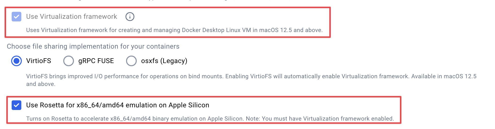

# pwn-docker

A docker container for pwn with SIGPwny on Apple Silicon

## Setup

+ Install docker or upgrade to latest (tested on `v4.33.0`)

+ Enable 'Use Virtualization framework' and 'Use Rosetta for x86_64/amd64 emulation on Apple Silicon'



## Installation

```bash
git clone https://github.com/sigpwny/pwn-docker.git --depth 1 && cd pwn-docker
```

## Usage

```bash
./create.sh
```

Create a container.

> Type 'y' to bind to ~/ctf and make a non-ephemeral container.

```bash
./connect.sh
```

Connect to the non-ephemeral container if possible.

> Not needed if you are running the container in the background instead, just connect via `ssh -p 2222 root@localhost`


## Testing debugging

```bash
gcc dbg-test.c -o dbg-test-static -static -g
gcc dbg-test.c -o dbg-test-dynamic -g
ROSETTA_DEBUGSERVER_PORT=1234 ./dbg-test-static

# in a different terminal,
gdb ./dbg-test-static -ex 'target remote localhost:1234'
```
